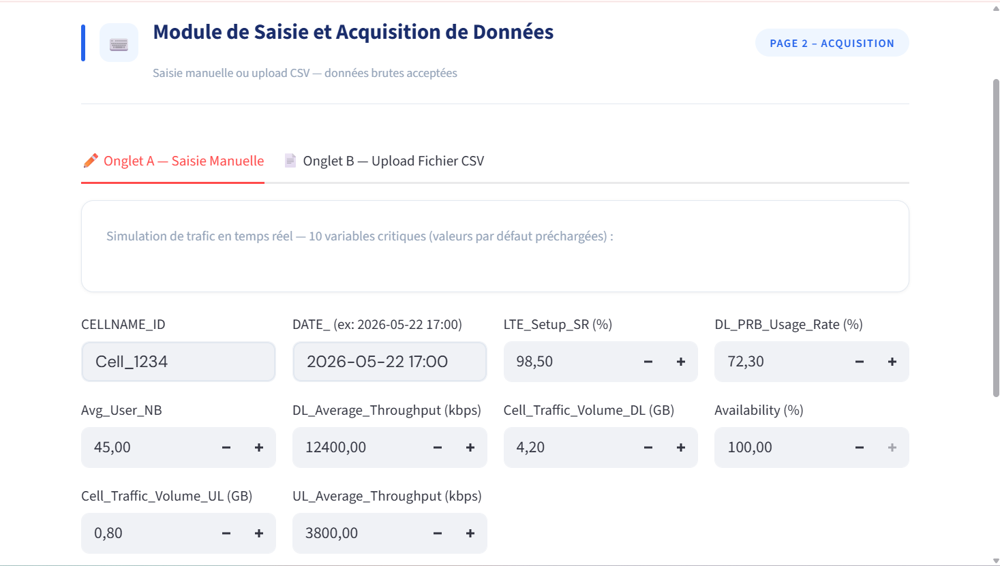
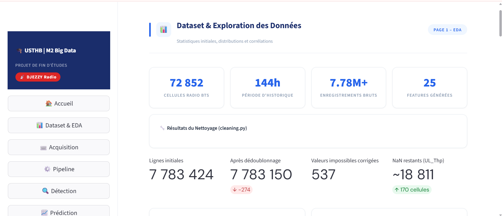
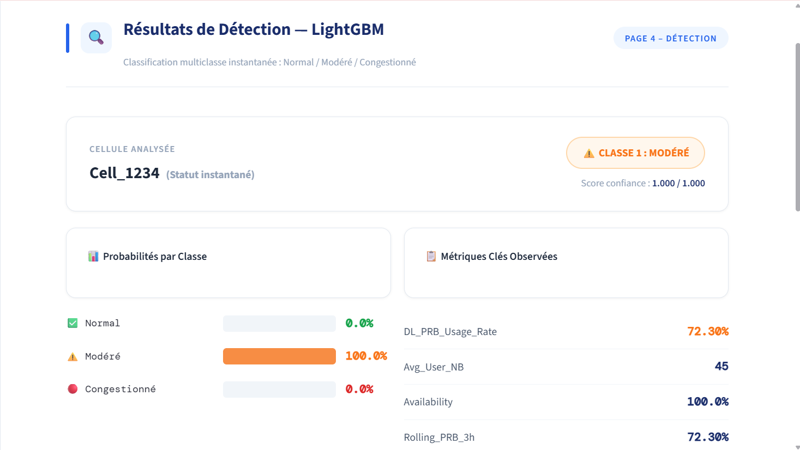
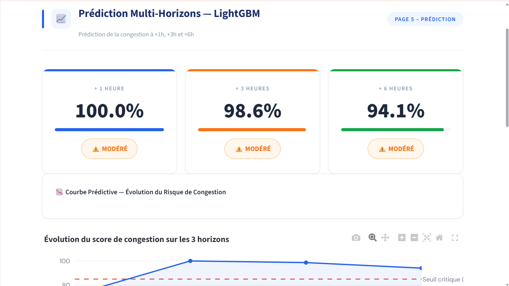
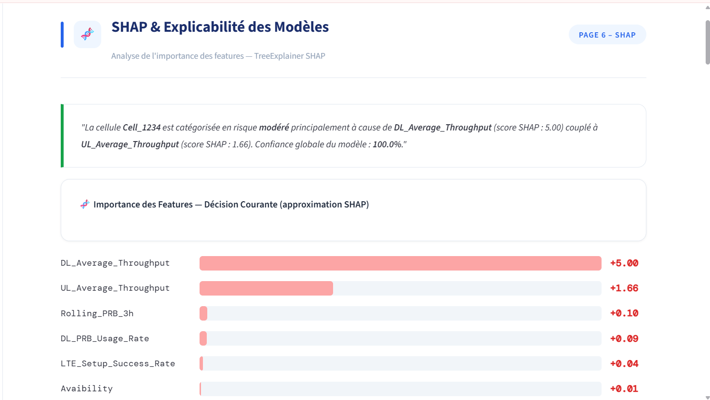
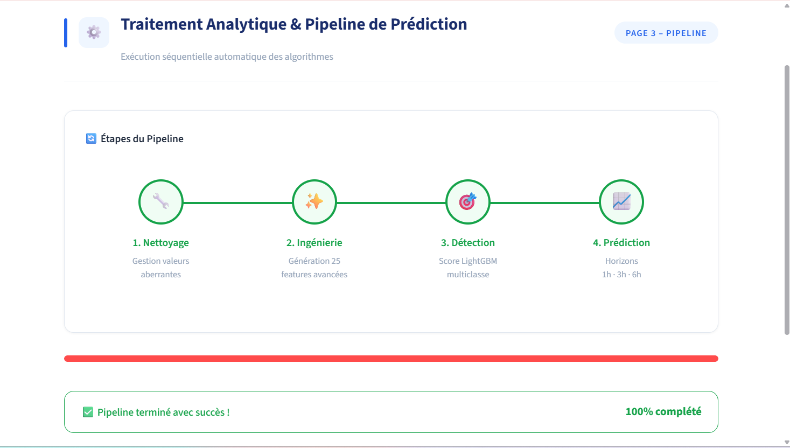
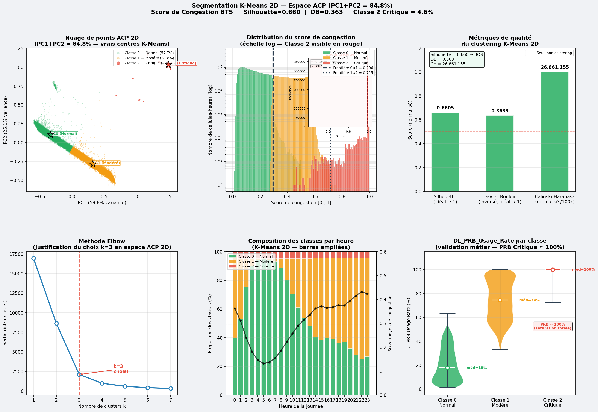
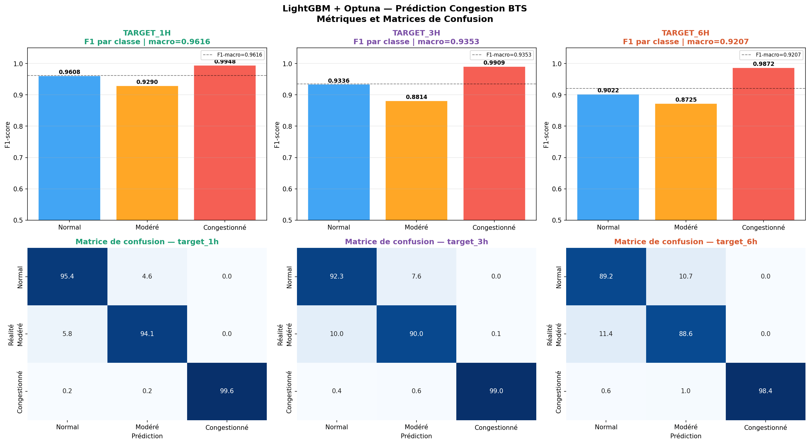

# 📡 LTE Congestion Detection & Multi-Horizon Prediction

### Intelligent Machine Learning Pipeline for LTE Network Monitoring, Congestion Detection & Predictive Network Operations

<p align="center">

**Real-Time Detection · H+1/H+3/H+6 Prediction · Explainable AI · Streamlit**

</p>

<p align="center">

[Overview](#-overview) •
[Demo](#-demo) •
[Results](#-key-results) •
[Architecture](#-architecture) •
[Methodology](#-methodology) •
[Installation](#-installation)

</p>

---

# 🚀 Overview

**LTE-Congestion-Detection-Prediction** is an end-to-end Machine Learning project designed to transform **reactive LTE network monitoring into predictive network intelligence**.

The system analyzes hourly Radio Access Network (RAN) KPIs from a large-scale LTE dataset and performs:

* 🔎 Real-time congestion detection
* 🔮 Multi-horizon prediction at **H+1, H+3 and H+6**
* 📊 LTE KPI analysis and temporal feature engineering
* 🧠 Machine Learning and Deep Learning model comparison
* 💡 Explainable AI using SHAP
* 🖥️ Interactive Streamlit application

The project was developed using data from the **Djezzy LTE network — Optimum Télécom Algérie**.

> 🎓 **Final Year Project — Master Big Data Analytics, USTHB — 2025/2026**

**Authors:** Zouarqui Aya & Khettab Wissam

---

# 🎯 Project Objective

Traditional network monitoring is mainly reactive:

```text
Congestion occurs
       ↓
Network degradation
       ↓
Problem detected
       ↓
Operator intervention
```

This project aims to move toward predictive network operations:

```text
Historical LTE KPIs
       ↓
Machine Learning
       ↓
Current network state
       ↓
Future congestion risk
       ↓
Early intervention
```

The system therefore answers two questions:

> **Is this LTE cell currently congested?**

and:

> **Will this cell become congested in the next 1, 3 or 6 hours?**

---

# 🖥️ Demo

L'application Streamlit permet de parcourir l'ensemble du pipeline d'inférence, depuis la saisie des KPI jusqu'à l'explication de la prédiction.

## 📥 Saisie d'une ligne KPI brute

L'utilisateur peut saisir ou charger les KPI d'une cellule LTE afin de lancer l'analyse.

<p align="center">  </p>

<p align="center"> <i>Interface de saisie d'une ligne de KPI LTE brute.</i> </p>


## 📊 Dashboard

<p align="center">
  
</p>

<p align="center">
  <i>Interactive Streamlit dashboard for LTE network monitoring.</i>
</p>

---

## 🔎 Congestion Detection

<p align="center">
  
</p>

<p align="center">
  <i>Real-time classification of LTE cell congestion.</i>
</p>

---

## 🔮 Multi-Horizon Prediction

<p align="center">
  
</p>

<p align="center">
  <i>Prediction of future congestion states at H+1, H+3 and H+6.</i>
</p>

---

## 💡 Explainable AI — SHAP

<p align="center">
  
</p>

<p align="center">
  <i>SHAP-based explanation of the model prediction.</i>
</p>

---

# 🏗️ Architecture

<p align="center">
  
</p>

The complete pipeline is organized as:

```text
                         LTE KPI DATA
                              │
                              ▼
                       Data Cleaning
                              │
                              ▼
                  Exploratory Data Analysis
                              │
                              ▼
                    Feature Engineering
                              │
                              ▼
                       PCA + K-Means
                      Auto Labeling
                              │
                 ┌────────────┴────────────┐
                 │                         │
                 ▼                         ▼
        Current Detection          Target Construction
        6 ML Classifiers              H+1 / H+3 / H+6
                 │                         │
                 │                         ▼
                 │                 Future Prediction
                 │                  LightGBM / LSTM / GRU
                 │                         │
                 └────────────┬────────────┘
                              ▼
                            SHAP
                       Explainability
                              │
                              ▼
                         Streamlit
                       Web Application
```

---

# 📊 Dataset

The dataset contains hourly measurements from the Djezzy LTE network.

| Characteristic         |                Value |
| ---------------------- | -------------------: |
| 📈 KPI records         |        **7,783,150** |
| 📡 LTE cells           |           **72,851** |
| 🌍 Geographic coverage |       **58 wilayas** |
| 📅 Period              | **26–31 March 2026** |
| 📊 Radio KPIs          |                **8** |
| 🕐 Granularity         |           **Hourly** |

The KPIs include, among others:

* PRB utilization rate
* Cell availability
* LTE establishment success rate
* Other radio performance indicators

> 🔐 **Data confidentiality:** Raw operator KPI data is not included in this repository.

The data schema and column descriptions are available in:

```text
data/README.md
```

---

# 🔬 Methodology

## 1. Unsupervised Congestion Labeling

The original dataset does not contain a native congestion label.

An unsupervised approach was therefore implemented using:

```text
LTE KPIs
   ↓
Standardization
   ↓
PCA
   ↓
2 Principal Components
   ↓
K-Means
   ↓
Normal / Moderate / Critical
```

### PCA

The PCA retained **84.8% of the total variance** using two principal components.

### K-Means

Three congestion classes were identified:

| Class       | Proportion |
| ----------- | ---------: |
| 🟢 Normal   | **57.65%** |
| 🟠 Moderate | **37.75%** |
| 🔴 Critical |  **4.59%** |

### Clustering Evaluation

| Metric               |   Result |
| -------------------- | -------: |
| Silhouette Score     | **0.66** |
| Davies-Bouldin Index | **0.36** |

<p align="center">
  
</p>

---

# 🤖 2. Supervised Congestion Detection

After automatic labeling, six supervised Machine Learning models were trained to detect the current congestion state.

### Models

* LightGBM
* XGBoost
* CatBoost
* Random Forest
* HistGradientBoosting
* MLP

Hyperparameters were optimized using **Optuna with TPE**.

The test set was constructed using a **strict chronological split** to avoid temporal leakage.

### Test Set

**1,167,473 observations**

---

# 📈 Model Benchmark

<p align="center">
  
</p>

| Model                |   Accuracy |   F1-macro | Critical F1 | Training Time |
| -------------------- | ---------: | ---------: | ----------: | ------------: |
| 🏆 **LightGBM**      | **99.92%** | **99.94%** | **99.997%** |        56 min |
| CatBoost             |     99.91% |     99.93% |     99.991% |        28 min |
| HistGradientBoosting |     99.92% |     99.93% |      99.98% |        25 min |
| MLP                  |     99.92% |     99.93% |      99.98% |       173 min |
| Random Forest        |     99.89% |     99.91% |      99.99% |       116 min |
| XGBoost              |     99.63% |     99.72% |      99.97% |        10 min |

### 🏆 Best Model: LightGBM

LightGBM achieved:

* **99.92% accuracy**
* **99.94% F1-macro**
* **99.997% critical-class F1**
* **+32.76 percentage points** compared with the fixed-threshold baseline

LightGBM also provides a strong balance between predictive performance and training time.

---

# 🔮 3. Multi-Horizon Prediction

The next objective is to predict future congestion instead of only detecting the current state.

Three prediction horizons were studied:

```text
Current time
     │
     ├──────────────► H+1
     │
     ├────────────────────────► H+3
     │
     └──────────────────────────────────► H+6
```

Temporal features were engineered to capture the evolution of LTE KPIs over time.

### Models Compared

* LightGBM
* LSTM + Temporal Attention
* GRU

### Results

| Horizon    |   F1-macro |  Critical F1 |
| ---------- | ---------: | -----------: |
| 🔵 **H+1** | **96.16%** | ≥ **98.73%** |
| 🟣 **H+3** | **93.58%** | ≥ **98.73%** |
| 🔴 **H+6** | **92.12%** | ≥ **98.73%** |

LightGBM outperformed the recurrent architectures across the three horizons.

As expected, predictive performance decreases gradually as the forecasting horizon increases.

---

# 💡 4. Explainable AI with SHAP

A high-performing model is not sufficient for operational network environments.

Network engineers need to understand **why** a cell has been classified as congested.

The project therefore integrates **SHAP — SHapley Additive exPlanations**.

### Main Explanatory Features

**Normal / Moderate**

> PRB utilization is the main discriminating feature.

**Critical**

> Cell availability and LTE establishment success rate are among the most influential features.

This transforms the output from:

```text
Prediction: CRITICAL
```

into:

```text
Prediction: CRITICAL

Why?

• High PRB utilization
• Reduced cell availability
• LTE establishment degradation
```

This improves the interpretability and operational usefulness of the system.

---

# 🖥️ 5. Streamlit Application

The project includes an interactive web application built with **Streamlit**.

The application integrates the complete inference pipeline:

```text
Raw KPI
   ↓
Feature Engineering
   ↓
Current Detection
   ↓
H+1 / H+3 / H+6 Prediction
   ↓
SHAP Explanation
```

### Main Features

* 🏠 Dashboard
* 📊 Exploratory Data Analysis
* 🔎 Current congestion detection
* 🔮 Multi-horizon prediction
* 💡 SHAP explanations
* 📈 Interactive visualizations
* ⚡ Cached model inference

The four LightGBM models are serialized using **Joblib** and loaded using:

```python
@st.cache_resource
```

Feature engineering is executed at inference time using the same logic applied during training.

---
# 🖼️ Screenshots

### Dashboard


### Pipeline complet


### Saisie d'une ligne KPI brute


### Clustering ACP + K-Means


### Détection en temps réel


### Comparaison des modèles


### Prédiction multi-horizons (H+1 / H+3 / H+6)


### Explicabilité SHAP


# 🛠️ Tech Stack

### Programming

```text
Python 3.11
```

### Data & Machine Learning

```text
pandas
NumPy
scikit-learn
LightGBM
XGBoost
CatBoost
Optuna
```

### Deep Learning

```text
TensorFlow
PyTorch
LSTM
GRU
Temporal Attention
```

### Explainable AI

```text
SHAP
```

### Visualization & Application

```text
Streamlit
Plotly
Joblib
```

---

# 📁 Repository Structure

```text
LTE-Congestion-Detection-Prediction/
│
├── app/
│   ├── app.py
│   ├── .streamlit/
│   │   └── config.toml
│   └── assets/
│       └── Application assets
│
├── assets/
│   ├── pipeline.png
│   ├── dashboard.png
│   ├── detection.png
│   ├── prediction.png
│   ├── shap.png
│   ├── model_comparison.png
│   └── kmeans.png
│
├── nettoyage/
│   └── nettoyage.py
│
├── eda/
│   ├── correlation.py
│   ├── distributionTemporelle.py
│   ├── B3_distribution_temporelle.png
│   └── B4_correlations.png
│
├── feature_engineering/
│   └── feautres.py
│
├── acp_kmeans/
│   ├── acpkmeans3.py
│   ├── coefficients_acp_final.csv
│   ├── kmeans_final.png
│   └── kmeans_summary.csv
│
├── detection/
│   ├── catboost/
│   ├── histgradientboosting/
│   ├── lightgbm/
│   ├── mlp/
│   ├── random_forest/
│   └── xgboost/
│
├── target/
│   ├── target.py
│   ├── test_stationnarite.py
│   └── rapport_targets_analyse.docx
│
├── prediction/
│   ├── gru/
│   ├── lightgbm/
│   └── lstm/
│
├── data/
│   └── README.md
│
├── requirements.txt
├── LICENSE
├── .gitignore
└── README.md
```

---

# 🚀 Installation

## 1. Clone the Repository

```bash
git clone https://github.com/ayazouarqui-cloud/LTE-Congestion-Detection-Prediction.git
cd LTE-Congestion-Detection-Prediction
```

## 2. Create a Virtual Environment

### Windows

```bash
python -m venv .venv
.venv\Scripts\activate
```

### Linux / macOS

```bash
python -m venv .venv
source .venv/bin/activate
```

## 3. Install Dependencies

```bash
pip install -r requirements.txt
```

---

# ▶️ Run the Application

From the project root:

```bash
streamlit run app/app.py
```

The Streamlit application will then be available in your browser.

---

# 🔐 Data Privacy

The dataset used in this project originates from an operator environment and is subject to confidentiality restrictions.

Therefore:

> **Raw LTE KPI data is not included in this repository.**

The repository contains the project structure, processing scripts, Machine Learning implementations, visualizations and documentation.

For the data schema:

```text
data/README.md
```

---

# 📄 Academic Project

This project was developed as a **Final Year Project** for:

### Master Big Data Analytics

**Université des Sciences et de la Technologie Houari Boumediene — USTHB**

**Faculté d'Électronique et d'Informatique**

**Academic Year: 2025–2026**

### Authors

👩‍💻 **Zouarqui Aya**

👩‍💻 **Khettab Wissam**

---

# 📚 Project Documentation

The complete thesis covers:

* State of the art
* Dataset analysis
* Data preprocessing
* Exploratory Data Analysis
* Feature engineering
* PCA + K-Means labeling
* Supervised Machine Learning
* Optuna optimization
* Multi-horizon prediction
* LSTM / GRU comparison
* SHAP explainability
* Streamlit application

Main report:

```text
target/rapport_targets_analyse.docx
```

Additional analysis and experimental results are available throughout the repository.

---

# 📊 Key Results

| Metric                 |      Result |
| ---------------------- | ----------: |
| LTE KPI observations   |  **7.78M+** |
| LTE cells              |  **72,851** |
| Wilayas                |      **58** |
| PCA variance explained |   **84.8%** |
| Silhouette Score       |    **0.66** |
| Detection F1-macro     |  **99.94%** |
| Critical-class F1      | **99.997%** |
| H+1 F1-macro           |  **96.16%** |
| H+3 F1-macro           |  **93.58%** |
| H+6 F1-macro           |  **92.12%** |

---

# 💼 Skills Demonstrated

This project covers a complete applied Machine Learning workflow.

### 📦 Data Engineering

* Large-scale KPI preprocessing
* Data cleaning
* Data validation
* Temporal data processing
* Feature engineering

### 🤖 Machine Learning

* Unsupervised learning
* K-Means clustering
* PCA
* Classification
* Gradient Boosting
* Model benchmarking
* Hyperparameter optimization

### 🧠 Deep Learning

* LSTM
* GRU
* Temporal Attention

### ⏱️ Time-Series / Forecasting

* Temporal feature engineering
* Chronological train/test splitting
* Multi-horizon prediction
* H+1 / H+3 / H+6 forecasting

### 💡 Explainable AI

* SHAP
* Feature importance
* Local prediction explanations

### 🚀 Deployment / MLOps

* Model serialization
* Joblib
* Cached inference
* Streamlit application

---

# 🌟 Project Vision

The long-term objective is to move from reactive network monitoring toward **predictive and explainable network intelligence**.

```text
Reactive Monitoring
        ↓
Machine Learning Detection
        ↓
Predictive Network Monitoring
        ↓
Explainable AI
        ↓
Proactive Network Optimization
```

The project demonstrates how Machine Learning can be applied to large-scale telecom data to anticipate network congestion before it becomes a major service-quality issue.

---

<p align="center">

## 📡 From Network Monitoring to Predictive Network Intelligence

**Machine Learning · Time Series · Telecom · Explainable AI · MLOps**

<br><br>

⭐ **If you find this project interesting, consider giving the repository a star.**

</p>
